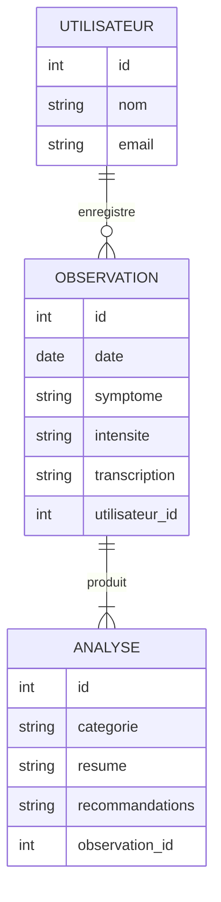

# 🩺 HealthVoice+ — Carnet de santé vocal intelligent et local

## 🎯 Idée principale

**HealthVoice+** est une application web qui permet à un utilisateur de **décrire son état de santé à la voix**.  
L’application comprend la parole, la transcrit, la classe et l’enregistre dans un **journal de santé personnel**, respectueux de la vie privée.  

Elle combine plusieurs outils d’intelligence artificielle et de web sémantique pour créer une base de données RDF consultable et analysable localement.

### ⚙️ Fonctionnement global

1. 🎙️ **Whisper (OpenAI)** → Transcription vocale  
   - L’utilisateur enregistre une note vocale décrivant ses symptômes.  
   - Whisper la convertit en texte brut.  

2. 🧠 **Ollama** → Reformulation et classification médicale  
   - Le texte est analysé et enrichi : symptômes, intensité, date, type.  

3. 🗂️ **Omeka S** → Stockage sémantique  
   - Chaque observation devient une ressource RDF décrite en Turtle.  
   - Exemple :
     ```turtle
     @prefix health: <http://example.org/health#> .
     @prefix schema: <http://schema.org/> .

     health:Observation001
         a schema:MedicalObservation ;
         schema:date "2025-10-06" ;
         schema:symptom "céphalée" ;
         schema:intensity "moyenne" .
     ```

4. 🤖 **AnythingLLM** → Analyse et résumé intelligent  
   - Génère des synthèses de l’état de santé sur une période donnée.  
   - Permet d’interroger les observations en langage naturel :
     > “Quels symptômes ai-je mentionnés cette semaine ?”  

5. 💾 **Stockage local & interface web (PHP/JS)**  
   - Les données sont enregistrées localement dans une base SQL.  
   - Une interface web permet la visualisation et le suivi.

---

## 🌱 Idées complémentaires pour améliorer le projet

### 🔍 Détection de tendances
- Analyse automatique des symptômes récurrents.
- Calcul d’un score de bien-être (graphiques JS).

### 📅 Rappels intelligents
- Alertes si un symptôme persiste ou si aucun enregistrement récent.

### 🧾 Journal multimédia
- Ajout possible d’images (médicaments, repas, activité physique).

### 🧬 Intégration sémantique avancée (RDF)
- Connexion à des vocabulaires médicaux : `schema.org`, `snomed`, `icd10`.

### 🗣️ Dialogue interactif
- L’utilisateur interroge son carnet (“Quand ai-je eu ma dernière migraine ?”) via AnythingLLM.

### 📊 Tableau de bord
- Visualisation des données de santé : graphiques, calendriers, tendances.

---

## 🧩 Diagramme Entité-Relation (Mermaid ERD)



---

## 🧰 Technologies utilisées

| Technologie | Rôle |
|--------------|------|
| **Whisper** | Transcription des notes vocales |
| **Ollama** | Reformulation, classification et enrichissement sémantique |
| **AnythingLLM** | Interrogation et synthèse des observations |
| **Omeka S** | Gestion et stockage RDF / Turtle |
| **PHP** | Traitement serveur et gestion des utilisateurs |
| **SQL** | Base de données relationnelle (utilisateurs, observations) |
| **JavaScript** | Interface dynamique, graphiques, interactions |
| **Markdown** | Documentation et export des rapports |
| **RDF / Turtle** | Représentation sémantique des données de santé |

---

## 🧱 Architecture du projet

```
HealthVoice+/
├── README.md
├── /frontend
│   ├── views/
│   ├── scripts/
├── /backend
│   ├── api/
│   ├── db/
│   └── rdf/
│       ├── model.ttl
│       └── vocabularies/
├── /data
│   ├── audio/
│   ├── transcriptions/
│   └── analyses/
└── /docs
    └── rapport.md
```

---

## 🧭 Objectifs pédagogiques

Ce projet permet de :

- Manipuler plusieurs **langages du Web** : SQL, PHP, JavaScript, RDF, Markdown.  
- Utiliser des outils d’**IA locale** (Whisper, Ollama, AnythingLLM).  
- Créer une **application sémantique interopérable** avec Omeka S.  
- Comprendre les liens entre **Web de données** et **Web intelligent**.  
- Développer une approche **éthique et respectueuse de la vie privée**.

---

## 📅 Auteurs & contexte

- **Étudiant :** BOUSSAID Amine  
- **Module :** Langages du Web – Master 2  
- **Enseignant :** M. Samuel Szoniecky  
- **Date :** Octobre 2025  

---

## 💬 Citation de synthèse

> *“HealthVoice+ transforme la voix en connaissance : un carnet de santé personnel, intelligent et éthique, au service du bien-être et du Web sémantique.”*
