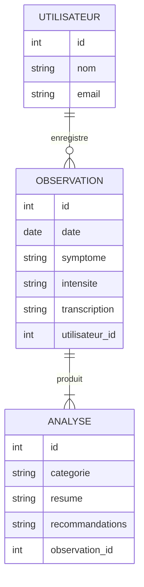

# 🩺 HealthVoice+ — Carnet de santé vocal intelligent et local

## 🎯 Idée principale

**HealthVoice+** est une application web qui permet à un utilisateur de **décrire son état de santé à la voix**.  
L’application comprend la parole, la transcrit, la classe et l’enregistre dans un **journal de santé personnel**, respectueux de la vie privée.  

Elle combine plusieurs outils d’intelligence artificielle et de web sémantique pour créer une base de données RDF consultable et analysable localement.

### ⚙️ Fonctionnement global

1. 🎙️ **Whisper (OpenAI)** → Transcription vocale  
   - L’utilisateur enregistre une note vocale décrivant ses symptômes.  
   - Whisper la convertit en texte brut.  

2. 🧠 **Ollama** → Reformulation et classification médicale  
   - Le texte est analysé et enrichi : symptômes, intensité, date, type.  

3. 🗂️ **Omeka S** → Stockage sémantique  
   - Chaque observation devient une ressource RDF décrite en Turtle.  
   - Exemple :
     ```turtle
     @prefix health: <http://example.org/health#> .
     @prefix schema: <http://schema.org/> .

     health:Observation001
         a schema:MedicalObservation ;
         schema:date "2025-10-06" ;
         schema:symptom "céphalée" ;
         schema:intensity "moyenne" .
     ```

4. 🤖 **AnythingLLM** → Analyse et résumé intelligent  
   - Génère des synthèses de l’état de santé sur une période donnée.  
   - Permet d’interroger les observations en langage naturel :
     > “Quels symptômes ai-je mentionnés cette semaine ?”  

5. 💾 **Stockage local & interface web (PHP/JS)**  
   - Les données sont enregistrées localement dans une base SQL.  
   - Une interface web permet la visualisation et le suivi.

---

## 🌱 Idées complémentaires pour améliorer le projet

### 🔍 Détection de tendances
- Analyse automatique des symptômes récurrents.
- Calcul d’un score de bien-être (graphiques JS).

### 📅 Rappels intelligents
- Alertes si un symptôme persiste ou si aucun enregistrement récent.

### 🧾 Journal multimédia
- Ajout possible d’images (médicaments, repas, activité physique).

### 🧬 Intégration sémantique avancée (RDF)
- Connexion à des vocabulaires médicaux : `schema.org`, `snomed`, `icd10`.

### 🗣️ Dialogue interactif
- L’utilisateur interroge son carnet (“Quand ai-je eu ma dernière migraine ?”) via AnythingLLM.

### 📊 Tableau de bord
- Visualisation des données de santé : graphiques, calendriers, tendances.

---

## 🧩 Diagramme Entité-Relation (Mermaid ERD)



---

## 🧰 Technologies utilisées

| Technologie | Rôle |
|--------------|------|
| **Whisper** | Transcription des notes vocales |
| **Ollama** | Reformulation, classification et enrichissement sémantique |
| **AnythingLLM** | Interrogation et synthèse des observations |
| **Omeka S** | Gestion et stockage RDF / Turtle |
| **PHP** | Traitement serveur et gestion des utilisateurs |
| **SQL** | Base de données relationnelle (utilisateurs, observations) |
| **JavaScript** | Interface dynamique, graphiques, interactions |
| **Markdown** | Documentation et export des rapports |
| **RDF / Turtle** | Représentation sémantique des données de santé |

---

## 🧱 Architecture du projet

```
HealthVoice+/
├── README.md
├── /frontend
│   ├── views/
│   ├── scripts/
├── /backend
│   ├── api/
│   ├── db/
│   └── rdf/
│       ├── model.ttl
│       └── vocabularies/
├── /data
│   ├── audio/
│   ├── transcriptions/
│   └── analyses/
└── /docs
    └── rapport.md
```

---

## 🧭 Objectifs pédagogiques

Ce projet permet de :

- Manipuler plusieurs **langages du Web** : SQL, PHP, JavaScript, RDF, Markdown.  
- Utiliser des outils d’**IA locale** (Whisper, Ollama, AnythingLLM).  
- Créer une **application sémantique interopérable** avec Omeka S.  
- Comprendre les liens entre **Web de données** et **Web intelligent**.  
- Développer une approche **éthique et respectueuse de la vie privée**.

---

## 📅 Auteurs & contexte

- **Étudiant :** BOUSSAID Amine  
- **Module :** Langages du Web – Master 2  
- **Enseignant :** M. Samuel Szoniecky  
- **Date :** Octobre 2025  

---

## 💬 Citation de synthèse

> *“HealthVoice+ transforme la voix en connaissance : un carnet de santé personnel, intelligent et éthique, au service du bien-être et du Web sémantique.”*

---

## 🌐 Interface Web API OMK

Une interface web moderne a été créée pour interagir avec l'API Omeka S : **`apiOmk.html`**

### 🚀 Fonctionnalités de l'interface

#### 📊 Dashboard principal
- **Statistiques en temps réel** : compteurs d'utilisateurs, observations et analyses
- **Navigation par onglets** : organisation claire des différentes sections
- **Bouton d'actualisation** : rechargement des données en un clic

#### 👥 Gestion des Utilisateurs
- **Formulaire de création** avec validation (nom, email)
- **Liste paginée** avec informations détaillées
- **Suppression sécurisée** avec confirmation

#### 📝 Gestion des Observations médicales
- **Formulaire complet** : date, symptôme, intensité, transcription, utilisateur associé
- **Liste avec badges colorés** selon l'intensité des symptômes
- **Association automatique** avec les utilisateurs existants

#### 🔍 Gestion des Analyses médicales
- **Formulaire d'analyse** : catégorie, résumé, recommandations, observation associée
- **Liste avec troncature** des textes longs
- **Lien automatique** avec les observations

### 🎨 Interface utilisateur

#### Design moderne
- **Bootstrap 5** pour un design responsive et moderne
- **Bootstrap Icons** pour des icônes cohérentes
- **Animations fluides** avec transitions CSS
- **Thème médical** avec couleurs appropriées (bleu primaire, vert succès, rouge danger)

#### Expérience utilisateur
- **Indicateurs de chargement** pendant les requêtes API
- **Messages d'alerte contextuels** (succès, erreur, avertissement)
- **Formulaires validés** côté client
- **Tables responsives** avec défilement horizontal sur petits écrans

### 🔧 Intégration API

#### Solution CORS avec proxy PHP

Pour éviter les problèmes CORS entre le navigateur et l'API Omeka S, un proxy PHP a été créé.

**Fichiers créés :**
- `apiOmk.html` - Interface web principale
- `proxy.php` - Proxy pour les requêtes API

#### Configuration
```javascript
// Frontend (apiOmk.html)
const API_BASE_URL = 'http://localhost:8000/proxy.php';

// Proxy PHP (proxy.php) - Configuration automatique avec vos clés
$API_KEY_IDENTITY = 'JK40IXvAADvNhrQwJJPjmcRmqpFLzjkI';
$API_KEY_CREDENTIAL = 'PpNWXhLVJSZ3fHfIX3b0eP6ddAnTZJUN';
```

#### Fonctionnalités API
- **Chargement automatique** des données au démarrage
- **Création d'éléments** avec structure JSON appropriée
- **Suppression sécurisée** avec gestion d'erreurs
- **Gestion des erreurs globale** avec messages utilisateur
- **Proxy transparent** pour éviter les problèmes CORS

#### Structure des données
- **Utilisateurs** : classe ID 106, template ID 6
- **Observations** : classe ID 107, template ID 7
- **Analyses** : classe ID 108, template ID 8

### 📱 Utilisation

1. **Démarrage du serveur** :
   ```bash
   cd "c:\Mes Documents\paris 8\THYP\Langages du Web\Projets\HealthVoice"
   python -m http.server 8000
   ```

2. **Accès à l'interface** :
   - Ouvrez `http://localhost:8000/apiOmk.html`
   - L'interface se charge automatiquement
   - Aucun problème CORS grâce au proxy PHP

3. **Navigation** :
   - Onglet **Utilisateurs** : créez d'abord quelques utilisateurs
   - Onglet **Observations** : ajoutez des observations médicales
   - Onglet **Analyses** : créez des analyses basées sur les observations

4. **Actualisation** : utilisez le bouton "Actualiser" pour recharger les données

### 🛠️ Technologies utilisées

- **HTML5** : Structure sémantique
- **CSS3** : Styles personnalisés et animations
- **JavaScript ES6+** : Fonctionnalités modernes (async/await, fetch API)
- **jQuery** : Simplification des manipulations DOM
- **Bootstrap 5** : Framework CSS responsive
- **Bootstrap Icons** : Bibliothèque d'icônes

### 🔒 Sécurité et performances

- **Validation des formulaires** côté client
- **Gestion d'erreurs robuste** avec logs console
- **Confirmation de suppression** pour éviter les accidents
- **Chargement asynchrone** pour une meilleure expérience utilisateur
- **Cache des données** pour optimiser les performances

### 📋 Checklist d'implémentation

- [x] Interface responsive avec Bootstrap 5
- [x] Gestion complète des utilisateurs (CRUD)
- [x] Gestion complète des observations (CRUD)
- [x] Gestion complète des analyses (CRUD)
- [x] Intégration API Omeka S
- [x] Gestion d'erreurs et messages utilisateur
- [x] Validation des formulaires
- [x] Indicateurs de chargement
- [x] Design moderne et intuitif
- [ ] Tests d'intégration
- [ ] Documentation utilisateur complète
